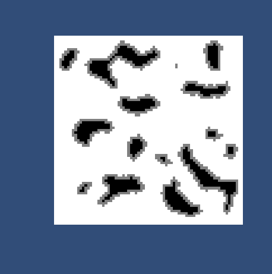
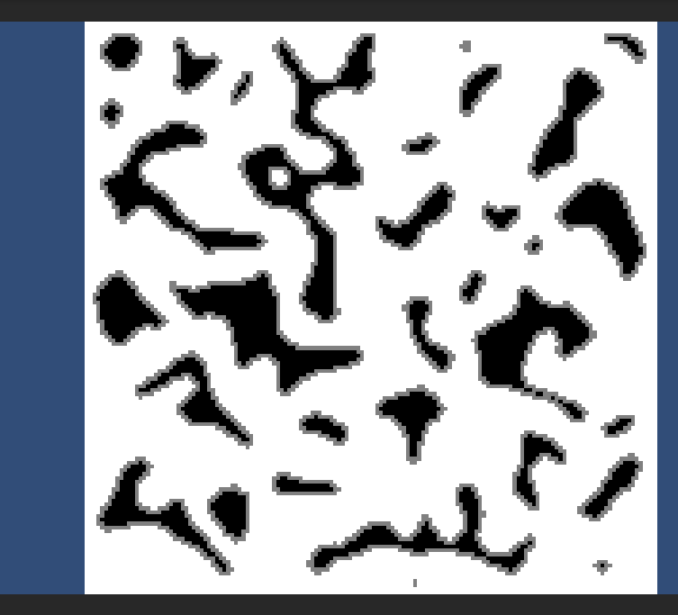

# Procedural Dungeon Generation using Cellular Automata

This project implements a real-time 2D dungeon generation system using **Cellular Automata (CA)** based on the method described in the following research paper:

> **Johnson, Yannakakis & Togelius (2010).**  
> [Cellular automata for real-time generation of infinite cave levels](https://dl.acm.org/doi/10.1145/1814256.1814266)  
> Presented at: *PCGames 2010, Monterey, CA*

The algorithm creates natural-looking, interconnected cave systems with tunable parameters for design control. The main goal was to translate the logic of the paper into working Unity code.

---

## Algorithm Summary

- A 2D grid (e.g. `150x150`) is initialized randomly with **rocks** or **floor tiles**.
- **Moore neighborhood** is used to apply CA iterations.
- A cell becomes rock if its neighbors ≥ `threshold`.
- Repeated iterations produce smooth and playable cave structures.

---

## Adjustable Parameters

| Parameter              | Description                                    | Suggested Value |
|------------------------|------------------------------------------------|-----------------|
| `InitialRockPercentage` | Probability of initial rock tiles             | `0.5`           |
| `IterationCount`       | Number of CA iterations                        | `3`             |
| `RockThreshold`        | Rock neighbor count needed to stay rock        | `13`            |
| `MooreNeighborhoodSize`| Distance for neighborhood evaluation           | `2`             |
| `Width` / `Height`     | Total size of dungeon                          | `150x150`       |

All values can be adjusted in the Unity Inspector.

---

## Example Screenshots

  
  &nbsp;&nbsp;&nbsp;&nbsp;&nbsp;
  

